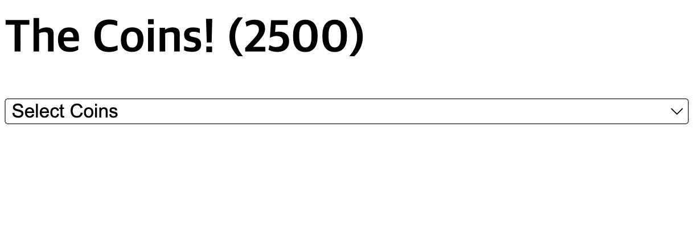
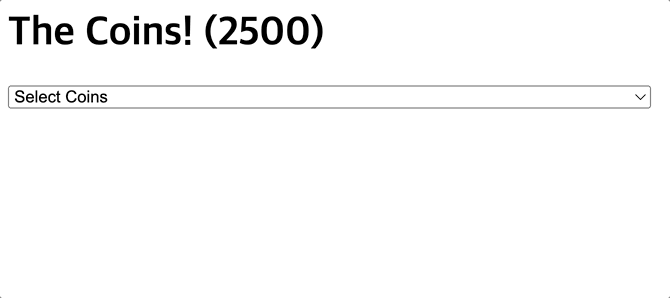
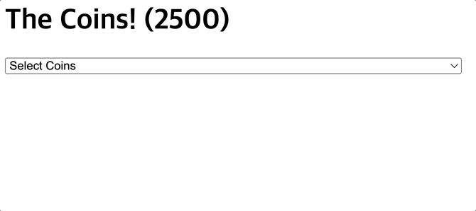
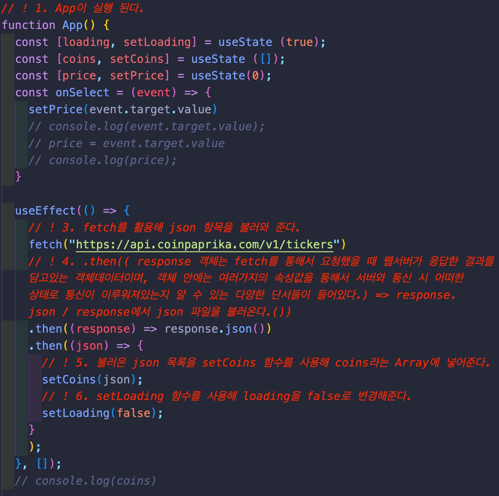

# react-coin-tracker

-----------------
## 🧑🏻‍💻 구현 목표

- [x] 로딩중에는 Laoding이라는 텍스트가 나오고 로딩이 되면 coin 목록이 뜹니다.
- [x] api 기능을 활용해 coin json 목록을 불러 옵니다.
- [x] select 기능을 활용해 coin 선택을 할 수 있습니다.
- [x] 달러 -> 코인 / 코인 -> 달러 가격 비교를 할 수 있습니다.
   
-----------------

## 🖼 메인프레임

- 간단하게 api로 json 목록을 불러와서 coin 목록을 띄웁니다.
   
------------------

## 💻 메인페이지

### 코인 목록
- select 기능으로 코인을 선택할 수 있습니다.

  

### 계산
- 달러를 입력하면 코인으로, 코인을 입력하면 달러로 계산해줍니다.
   
------------------
## 📕 배운 것

* fetch 기능을 활용해 json 목록을 불러올 수 있다.
- https://api.coinpaprika.com/v1/tickers / api 기능을 활용해 json을 fetch로 코드에 넣었다.

  

* json 내부에 다양한 item을 활용 가능하다.
- const [coins, setCoins] = useState ([]); / coins라는 Array를 만들어서 setcoins 함수를 활용해 fetch로 json을 coins로 변경해주면 json 내부에 다양한 item을 활용할 수 있다.

* {xxx ? "" : ""} = {xxx ? 만약 xxx가 true라면 동작 : 만약 xxx가 false 라면 동작}
- if를 활용해서 loading 하는 동안 다른 화면을 띄울수 있다.

   
------------------
## 🔨 수정해야 할 것

### ❌ 보기 좋게 CSS 수정

   

## 사용 라이브러리
|React|
|---|
